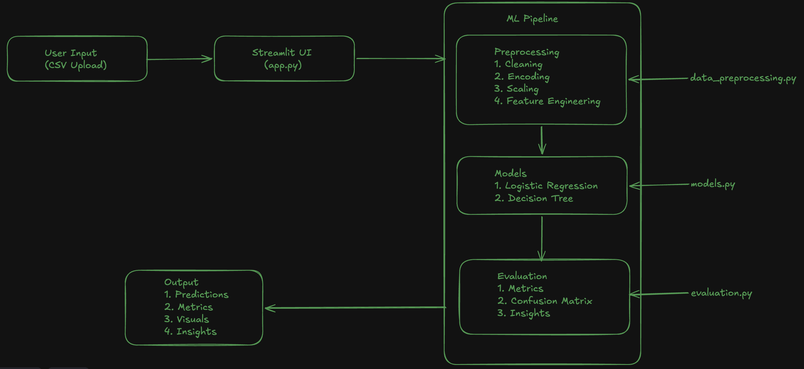

Telco Customer Churn Predictor

> **A machine learning-powered web application that predicts customer churn for telecom companies using Logistic Regression and Decision Tree classifiers, built with Streamlit.**

[](https://python.org)
[](https://streamlit.io)
[](https://scikit-learn.org)

---

##  Overview

Customer churn is one of the biggest challenges for telecom companies. This project provides an **end-to-end ML pipeline** that:

- Ingests raw customer data via CSV upload
- Automatically cleans, encodes, and engineers features
- Trains **two classification models** and compares their performance
- Delivers **actionable business insights** through an interactive Streamlit dashboard

The application is designed to help business stakeholders understand **who is likely to churn and why**, enabling proactive retention strategies.

---

## System Design

<p align="center">
  
</p>

---

##  Project Structure

```
GenAI_Capstone/
│
 ├── app.py                   #  Streamlit application — main entry point
 ├── data_preprocessing.py    #  Data cleaning & feature engineering
 ├── models.py                #  Model training & prediction logic
+├── agent.py                 #  NEW: AI Agentic Layer (GenAI Logic)
 ├── evaluation.py            #  Metrics calculation & visualization
 ├── requirements.txt         #  Python dependencies
+├── .env.example             #  Template for API keys
 ├── assets/
 │   └── genai_capstone_systemdesign.png    #   System architecture diagram
 └── README.md                # You are here!
```

---

##  Milestone 2: Agentic AI & GenAI

In this phase, we implemented **Advanced GenAI** features to transform the project from a simple predictor to an **Agentic System**.

| Element | Implementation | Purpose |
|---|---|---|
+| **LLM Integration** | Google Gemini 1.5 Flash | Provides reasoning and natural language explanations for churn. |
+| **RAG-Lite** | Simulated Knowledge Base Retrieval | Pulls retention best practices ('Knowledge') to inform the Agent's advice. |
+| **Agentic Reasoning** | `ChurnAnalystAgent` class | Combines raw data + ML probability + RAG context to output a human strategy. |

---

##  Module Breakdown

### 1. `data_preprocessing.py` — Data Cleaning & Feature Engineering

This module handles all data transformation before model training.

| Function | Description |
|---|---|
| `load_and_clean_data(file_path)` | Reads the CSV, drops `customerID`, converts `TotalCharges` to numeric, fills missing values with **median**, maps Yes/No columns to binary, and creates engineered features. |
| `prepare_features(df)` | Separates features (`X`) from target (`y`), applies **StandardScaler** on numeric columns and **OneHotEncoder** on categorical columns using `ColumnTransformer`. Returns processed arrays and feature names. |

**Feature Engineering:**

| Feature | Logic | Purpose |
|---|---|---|
| `AvgChargePerMonth` | `TotalCharges / (tenure + 1)` | Captures the average revenue per month for each customer |
| `TenureGroup` | Bins: `New` (0–12), `Mid` (13–48), `Loyal` (49+) | Groups customers by loyalty stage for better segmentation |

---

### 2. `models.py` — Model Training & Prediction

Houses the `ChurnModels` class that encapsulates the full training and inference pipeline.

| Method | Description |
|---|---|
| `__init__(X_train, X_test, y_train, y_test)` | Initializes the model container with train/test splits |
| `train_models(feature_names)` | Trains **Logistic Regression** (`max_iter=1000`) and **Decision Tree** (`max_depth=10`) |
| `predict_proba(X)` | Returns churn probability scores from both models |
| `predict(X)` | Returns binary churn predictions (0 or 1) from both models |
| `get_metrics(y_true, log_pred, dt_pred)` | Computes Accuracy, Precision, Recall, and F1 Score for both models |
| `get_insights()` | Extracts Decision Tree feature importances and Logistic Regression coefficients |

---

### 3. `evaluation.py` — Metrics & Visualization

Provides functions for evaluating and visualizing model performance.

| Function | Description |
|---|---|
| `print_metrics(metrics)` | Formats and displays a comparison table of model metrics |
| `plot_confusion_matrix(y_true, y_pred, model_name)` | Renders a confusion matrix heatmap using `matplotlib` |
| `plot_feature_importance(feature_names, dt_importance, lr_coef, top_n=10)` | Plots the **Top 10 churn drivers** from both models as horizontal bar charts, with key business insights |

---

### 4. `agent.py` — Agentic AI Layer (NEW!)

| Method | Description |
|---|---|
| `__init__()` | Configures Google Generative AI (Gemini) using `.env` |
| `get_customer_insight(data, pred)` | An **Agentic workflow** that processes customer attributes and model confidence to generate a human-readable retention report. |
| `search_knowledge_base(topic)` | A **RAG-lite** function that simulates retrieving policy information to ground the Agent's response. |

---

### 4. `app.py` — Streamlit Dashboard (Main Entry Point)

The interactive web interface that ties everything together.

| Section | What It Does |
|---|---|
| **Sidebar** | Displays usage instructions for the user |
| **CSV Upload** | Accepts the Telco Customer Churn dataset and previews the data |
| **Train & Evaluate** | One-click button to train both models on an 80/20 stratified split |
| **Model Performance** | Side-by-side metrics table with the winning model auto-highlighted |
| **Sample Predictions** | Shows 5 random customers with true labels, predicted labels, and churn probabilities |
| **Feature Insights** | Decision Tree importance + Logistic Regression coefficients + key business takeaways |
| **AI Agent Insights** | (New) Generates deep, human-friendly reasons and strategies for individual customers. |

---

##  Key Features

-  **CSV Upload** — Drag-and-drop the Telco Churn dataset
-  **Dual Model Training** — Logistic Regression + Decision Tree trained simultaneously
-  **Comprehensive Evaluation** — Accuracy, Precision, Recall, F1, and Confusion Matrix
-  **Auto Model Comparison** — Winning model detected and highlighted automatically
-  **Churn Probability Scores** — See how confident each model is about its prediction
-  **Feature Importance Insights** — Understand **which features drive churn** most
-  **Actionable Business Insights** — Key takeaways like "Month-to-month contracts → HIGH churn risk"
-  **Agentic Analysis** — AI Agent that 'reasons' why a customer might leave
-  **Knowledge Retrieval** — Simulated RAG to provide domain-specific retention advice

---

## 🛠️ Tech Stack

| Layer | Technology |
|---|---|
| **Language** | Python 3.10+ |
| **ML Framework** | scikit-learn (Logistic Regression, Decision Tree, StandardScaler, OneHotEncoder) |
| **Web Framework** | Streamlit |
| **Data Handling** | Pandas, NumPy |
| **Visualization** | Plotly, Matplotlib, Seaborn |
| **GenAI / Agents** | Google Generative AI (Gemini API) |
| **Environment** | python-dotenv |

---

## Quick Start

### Prerequisites

- Python 3.10 or higher
- pip package manager

### Installation

1. **Clone & Setup:**
   ```bash
   git clone https://github.com/khushijain/GenAI_Capstone.git
   cd GenAI_Capstone
   pip install -r requirements.txt
   ```

2. **API Keys:**
   - Copy `.env.example` to `.env`.
   - Get your Gemini API Key from [Google AI Studio](https://aistudio.google.com/).
   - Add it to your `.env` file:
     ```env
     GOOGLE_API_KEY=your_actual_key_here
     ```

3. **Run:**
   ```bash
   streamlit run app.py
   ```

The app will open at `http://localhost:8501`. Upload the **WA_Fn-UseC_-Telco-Customer-Churn.csv** file to get started.

---

## Dataset

This project uses the [Telco Customer Churn](https://www.kaggle.com/datasets/blastchar/telco-customer-churn) dataset from Kaggle.

| Property | Value |
|---|---|
| **Rows** | 7,043 customers |
| **Features** | 21 columns (demographics, account info, services) |
| **Target** | `Churn` (Yes / No) |
| **Class Balance** | ~26.5% churned, ~73.5% retained |

---

## 📈 Key Insights from the Model

| Insight | Impact |
|---|---|
| **Month-to-month contracts** | → **HIGH** churn risk |
| **Higher tenure** | → **LOWER** churn risk (loyal customers stay) |
| **Higher MonthlyCharges** | → **HIGHER** churn risk |
| **Lack of online security / tech support** | → **HIGHER** churn risk |

---

Requirements

```
pandas>=2.2.0
numpy>=1.26.0
scikit-learn>=1.4.0
streamlit>=1.28.1
matplotlib>=3.8.0
seaborn>=0.13.0
plotly>=5.17.0
```

---

Contributing

1. Fork the repository
2. Create your feature branch (`git checkout -b feature/AmazingFeature`)
3. Commit your changes (`git commit -m 'Add some AmazingFeature'`)
4. Push to the branch (`git push origin feature/AmazingFeature`)
5. Open a Pull Request

---

License

This project is open source and available under the [MIT License](LICENSE).

---

<p align="center">
  <b>Built with using Python, scikit-learn & Streamlit</b>
</p>
